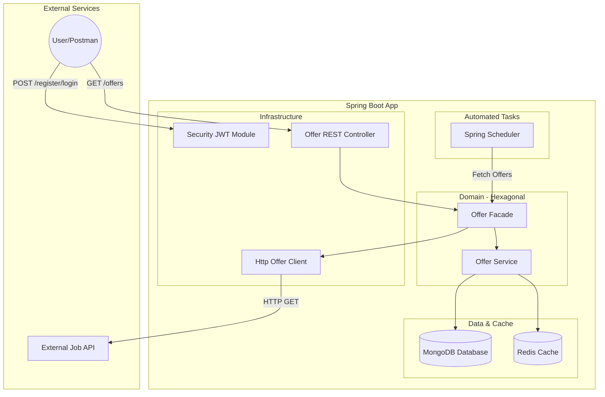

# JobOffers Application 💼
**Author: Agnieszka Magura** 

## 📖 Description
JobOffers is a robust backend system built with Spring Boot 2.7.8, designed to automate the job search process for Junior Java Developers. The application serves as a centralized hub for collecting, managing, and notifying users about new career opportunities.

### **Key Features:**
* **Automated Data Fetching**: An integrated **Scheduler** periodically fetches the latest job postings from external servers at specified intervals.
* **Security & Authentication**: Access to job offers is secured via a registration and login system, utilizing **JWT (JSON Web Tokens)** for stateless authentication.
* **Offer Management**: Authenticated users can browse the aggregated database of offers or manually add new listings.
* **Data Integrity**: The system ensures that duplicate offers are handled correctly, and expired or irrelevant data can be managed during scheduler cycles.

#### **Architecture & Principles:**
The project is strictly developed following Clean Architecture and Hexagonal Architecture (Ports and Adapters) principles. This ensures:

* **Decoupling:** The core business logic remains independent of technical details like databases (MongoDB), external APIs, or security configurations.

* **Testability:** High test coverage across domain logic, integration points, and API endpoints.

## 🏗️ Architecture & Flow
The project utilizes the **Ports and Adapters** pattern. This allows the core domain to remain independent of technical details like databases, external APIs, or security configurations.

## 🛠️ Technologies & Skills

### Core

### Testing

* **Core Details:** Java 17, Spring Boot 2.7.8 (Web, Security + JWT, Validation, Data MongoDB, Scheduler)
* **Databases:** MongoDB + MongoExpress, Redis & Jedis (with Redis-Commander)
* **Testing Details:** * **Unit Tests:** JUnit 5, Mockito, AssertJ
    * **Integration Tests:** Testcontainers, WireMock, Awaitility
    * **API Testing:** MockMvc, RestTemplate

## 🧪 Quality Assurance
The application was built with a strong emphasis on code quality:
* **Asynchrony:** Testing scheduled tasks using **Awaitility**.
* **Mocking:** Simulating external job servers with **WireMock**.
* **Real Environment:** Using **Testcontainers** to run integration tests on actual MongoDB instances.

## 📡 API Endpoints
| Method | Endpoint | Description | Access |
| :--- | :--- | :--- | :--- |
| `POST` | `/register` | Register a new user account | Public |
| `POST` | `/token` | Authenticate and get JWT Token | Public |
| `GET` | `/offers` | Retrieve all job offers | Private |
| `GET` | `/offers/{id}` | Find a specific offer by ID | Private |
| `POST` | `/offers` | Manually add a new offer | Private |

🚀 How to run
1. Clone the repository: git clone https://github.com/AgnieszkaMagura/JobOffers.git

2. Spin up the infrastructure: docker-compose up (requires Docker Desktop).

3. Build and run the app: ./mvnw spring-boot:run or via your IDE.

4. API Documentation is available at: http://localhost:8000/swagger-ui/index.html (port depends on your local configuration).

 ## 🤝 Contact
**Author:** Agnieszka Magura  
**LinkedIn:** [Agnieszka Magura](https://www.linkedin.com/in/agnieszka-magura-0714241a8/)

If you like this project, please consider giving it a ⭐!
